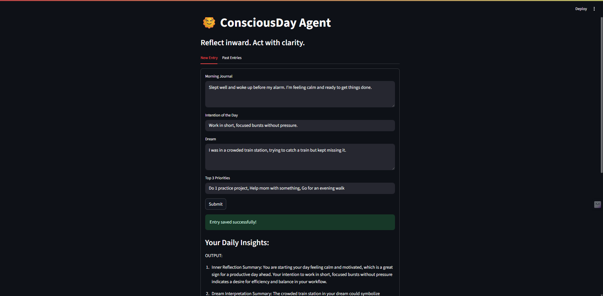
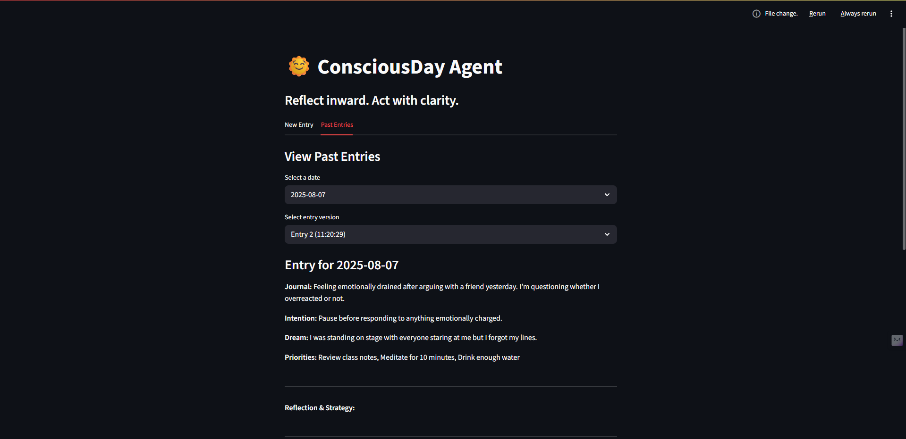

# 🌞 ConsciousDay Agent

[](https://conciousday-agent.streamlit.app/)

A journaling-based AI assistant that provides emotional insights and daily strategies based on your morning reflections.

# Project Demo
https://github.com/user-attachments/assets/841f5fba-1c38-4201-b1b7-e4805ee41feb

# Screenshots



## Features

- ✍️ **Daily Journaling** with AI-powered emotional analysis
- 💭 **Dream Interpretation** using psychological patterns
- 🎯 **Smart Daily Planning** based on your priorities
- 📅 **Entry History** with versioning (multiple entries per day)
- 🔍 **Insight Generation** with actionable strategies

## How to Use
1. Fill out your morning journal
2. Add your daily intention
3. Describe any dreams (optional)
4. List your top 3 priorities
5. Get AI-generated insights and strategy

## Tech Stack
- Frontend: Streamlit
- AI: OpenRouter API (gpt 3.5 turbo) + LangChain
- Database: SQLite
- Deployment: Streamlit Sharing

## Local Setup
```bash
git clone https://github.com/Kabshah/ConsciousDay-Agent.git
cd ConsciousDay-Agent
pip install -r requirements.txt
streamlit run main.py
```
## Configuration
Create a .env file:
```bash
env
OPENROUTER_API_KEY=your_api_key_here
```
For deployment secrets (Streamlit Sharing):
```bash
toml
# .streamlit/secrets.toml
OPENROUTER_API_KEY = "your_api_key_here"
```
